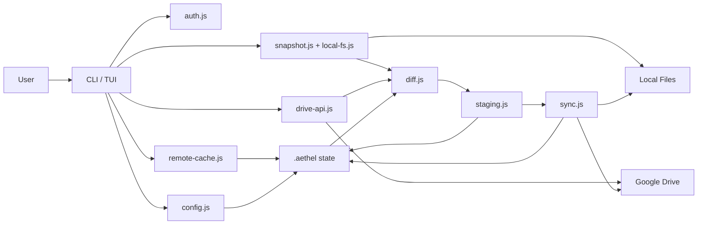

# Aethel Architecture

## 1. Project Positioning

Aethel is a synchronization tool that uses Google Drive as its remote storage. It exposes two interface layers:

- CLI: provides a Git-like workflow with `auth`, `init`, `status`, `diff`, `add`, `commit`, `pull`, and `push`.
  Git-compatible forms such as `status --short`, `diff --staged`, `add -A`,
  `reset HEAD <path>`, `restore --staged`, `log --oneline`, `show --stat`,
  `rev-parse HEAD`, `branch -v`, `switch -c <name>`, `tag <name> HEAD`,
  `remote -v`, `clone <folder> <dir>`, and `restore --source <ref>` are
  aliases over Aethel's Drive sync state.
- TUI: provides an interactive dual-pane interface for local files and Google Drive.

The core design is not a live mirror between local storage and Drive. Instead, synchronization is managed through a `snapshot + diff + staging + execute` pipeline.

## 2. Module Layers

### 2.1 Entry Layer

- `src/cli.js`
  - Command-line entry point
  - Parses commands, assembles workspace state, and invokes core sync capabilities
- `src/tui/index.js`
  - Starts the Ink TUI
- `src/tui/app.js`
  - Implements dual-pane file browsing, filtering, uploads, deletion, and interactive operations

### 2.2 Core Capability Layer

- `src/core/auth.js`
  - OAuth authentication
  - Creates and reads `token.json`
- `src/core/drive-api.js`
  - Google Drive API wrapper
  - Listing, downloading, uploading, deleting, folder creation, and batch operations
  - Ignore-aware remote cleanup helpers for `clean --ignored`
- `src/core/local-fs.js`
  - Local filesystem operations
- `src/core/snapshot.js`
  - Scans local files, computes md5 hashes, and builds snapshots
- `src/core/diff.js`
  - Compares snapshot / remote / local state and produces change sets
- `src/core/staging.js`
  - Manages the staging area
- `src/core/sync.js`
  - Executes staged operations
- `src/core/config.js`
  - Manages `.aethel/` state files
- `src/core/ignore.js`
  - Manages `.aethelignore`
- `src/core/remote-cache.js`
  - Short-lived cache for remote listings
- `src/core/compress.js`
  - Multi-algorithm compression (gzip, brotli, zstd, xz)
  - Compression profiles and algorithm detection
- `src/core/pack.js`
  - Tar archive creation and extraction
  - Tree hash algorithm for fast directory fingerprinting
- `src/core/pack-manifest.js`
  - CRUD operations for pack manifest
  - Tracks packed directories and their sync state

### 2.3 State Storage Layer

After workspace initialization, the project root contains:

```text
.aethel/
  config.json
  index.json
  .hash-cache.json
  pack-manifest.json
  snapshots/
    latest.json
    history/
.aethelconfig
```

- `config.json`: sync root configuration
- `index.json`: currently staged operations
- `.hash-cache.json`: local file hash cache
- `pack-manifest.json`: tracks packed directories and their sync state
- `snapshots/latest.json`: baseline state after the most recent successful sync
- `snapshots/history/`: archived older snapshots
- `.aethelconfig` (workspace root): YAML configuration for directory packing

## 3. Core Data Flow



## 4. Synchronization Model

### 4.1 Baseline

Aethel uses `snapshot` as the shared baseline:

- `snapshot.files`: remote file information from the last sync
- `snapshot.localFiles`: local file information from the last sync

That means the system does not compare only "local vs remote". It also asks:

- Has Drive changed since the last sync?
- Has local state changed since the last sync?
- Did both sides modify the same path?

### 4.2 Diff Categories

`src/core/diff.js` classifies changes as:

**File changes:**
- `remote_added`
- `remote_modified`
- `remote_deleted`
- `local_added`
- `local_modified`
- `local_deleted`
- `conflict`

**Pack changes (for packed directories):**
- `pack_new` - directory newly configured for packing
- `pack_local_modified` - packed directory changed locally
- `pack_remote_modified` - packed directory changed on Drive
- `pack_synced` - packed directory up to date
- `pack_conflict` - both sides changed the packed directory

It also provides default suggested actions for each category:

- Drive added/modified -> `download`
- Drive deleted -> `delete_local`
- Local added/modified -> `upload`
- Local deleted -> `delete_remote`
- Both sides changed the same path -> `conflict`
- Pack new/local modified -> `push_pack`
- Pack remote modified -> `pull_pack`

When `push --force` is used, local state is authoritative. Drive-only additions
are converted into `delete_remote` operations, collapsed to the highest missing
local ancestor, and deduplicated so removed folder trees are pruned in one pass.
- Pack conflict -> `resolve_pack`

### 4.3 Execution Model

`commit` is not a Git commit. It executes the synchronization actions currently staged:

1. Acquire the workspace execution lock and recover unacknowledged completions.
2. Read `index.json` and assign durable operation IDs.
3. Flush each start record before mutation and each completion record afterward.
4. Retain failed entries and block operations that depend on failed folder moves.
5. Advance the baseline for completed operations, including partial successes.
6. Persist receipt IDs with the snapshot before retiring their journal records.

`commit-coordinator.js` owns this sequence for CLI and repository commits.
`execution-journal.js` records execution outcomes independently of diagnostics.
`workspace-lock.js` serializes commit execution and snapshot saving. The low-level
executor may clear completed staging entries after their receipts are durable;
those receipts remain recoverable until the coordinator saves the baseline.

`src/core/baseline.js` owns baseline advancement for commits and pulls. A fresh
Drive listing is an observation, not proof that this device applied every remote
change. Unapplied entries retain their previous IDs, paths, and hashes. This
prevents an unrelated push on device B from forgetting a rename or deletion
made by device A and later treating B's old file as a new local addition.
Metadata moves carry the previous content hashes to the new paths, so pending
content edits remain visible. Transfers advance only matching local and remote
content; deletions advance only their completed scope.

Normal sync and status commands refresh remote observations, using the Drive
memo and changes feed where available. The observation cache and the per-device
sync baseline have separate purposes and must not replace one another.
Failed commits retain failed staging entries. Their completed operations still
advance the baseline. Snapshot failures preserve receipts for the next commit.
A snapshot records receipt IDs so recovery does not apply metadata moves twice.
Interrupted starts without durable outcomes stop with `RECOVERY_REQUIRED`.
Locks are not automatically stolen after process termination. This protects
against overlapping work but requires operator review after a hard crash.
The lock covers this local workspace, not other devices or direct Drive edits.

### 4.4 Diagnostic Logging

`src/core/logger.js` owns structured diagnostics, sanitization, retention, and
run context. `AsyncLocalStorage` carries the run ID through concurrent transfers
and nested repository calls. Standalone executor calls create their own run;
CLI calls share one context across state loading, execution, and baseline saving.
Each operation has a durable UUID to correlate journal records and diagnostic events.

One exclusively created file per run avoids shared-file rotation races. Records
are bounded JSON lines with schema version, UTC timestamp, process ID, sequence,
severity, event, and details. Completion flushes the file and removes its
`.active` suffix. A crash can leave an active file or an incomplete trailing
record; it must not be interpreted as successful completion.

Retention runs at creation and completion. Completed files are limited to 20
and seven days; active files expire after seven days. Each run is limited to
5 MiB with a reserved terminal record. Diagnostic I/O errors are isolated from
sync errors. Logs are local to `.aethel` and are excluded from synchronization.

## 5. Relationship Between TUI and CLI

Both interfaces share the same core modules. The difference is only the interaction surface:

- CLI is oriented toward predictable, scriptable sync workflows
- TUI is oriented toward manual inspection, fast operations, and hands-on Drive / Local management

The TUI is not a separate synchronization engine. It directly calls `drive-api.js` and `local-fs.js` for interactive file management.

## 6. Recommended Workflow

### 6.1 Initial Workspace Setup

```bash
npm install
npm run auth
node src/cli.js clone <drive-folder-id> ./workspace
node src/cli.js init --local-path ./workspace --drive-folder <drive-folder-id>
```

Use this when:

- Starting a new project
- Creating a new sync root
- Intentionally syncing only a specific Drive folder

### 6.2 Day-to-Day Sync Workflow

```bash
node src/cli.js status
node src/cli.js status --short
node src/cli.js diff --staged
node src/cli.js add -A
node src/cli.js restore --staged path/to/file
node src/cli.js commit -m "sync"
node src/cli.js remote -v
node src/cli.js log --oneline
node src/cli.js rev-parse --abbrev-ref HEAD
node src/cli.js switch -c experiment
node src/cli.js tag checkpoint HEAD
```

This is the most reasonable standard flow because:

1. `status` gives you the overall state first
2. `diff` shows details and conflicts
3. `add -A` stages the default suggested actions
4. `commit` performs the actual synchronization

This preserves a manual confirmation point and helps avoid pushing a bad state to Drive or overwriting local files by mistake.

### 6.3 Cleanup Workflows

`clean` is a remote maintenance command. Its default mode lists accessible
Drive files and can trash/delete them with the broad confirmation phrase.

`clean --ignored` is workspace-scoped. It reads the workspace `.aethelignore`,
lists items under the configured Drive sync root, filters remote paths through
the ignore rules, and reports only the topmost ignored files/folders. Execution
requires the narrower confirmation phrase `DELETE IGNORED GOOGLE DRIVE FILES`
and invalidates the remote cache after completion.

### 6.4 Refs

Aethel branch refs are stored under `.aethel/refs/branches.json`. Each branch
points at a snapshot ref, and the current branch is advanced when a new sync
snapshot is saved. Switching branches changes the active ref, but it does not
rewrite the local working tree by itself. Tags are lightweight names stored
under `.aethel/refs/tags.json` and point at snapshot refs, so `show`,
`rev-parse`, and `restore --source <ref>` can use memorable names without
changing Drive state.

### 6.5 When Conflicts Occur

Recommended flow:

1. Run `status` or `diff`
2. Identify `conflict` entries
3. Decide explicitly whether to keep local, keep remote, or keep both
4. Then stage and commit

Why:

- In Aethel, a conflict means both sides changed the same path after the snapshot
- This should not be resolved automatically because it can cause silent overwrites

### 6.4 When Manual Inspection Is Needed

```bash
npm run tui
```

The TUI is useful for:

- Browsing the Drive structure
- Selecting items and deleting them
- Uploading files or entire folders directly from local storage
- Finding files quickly with filters
- Watching the current local directory for edits, renames, and deletes while
  keeping Drive operations reconciled by a fresh remote reload

If the goal is traceable, repeatable synchronization, the CLI workflow should still be the default choice.

## 7. Recommended Practices

- Use a single Drive root folder as the workspace remote root instead of syncing the entire My Drive directly.
- Run `status` or `diff` before every `commit`.
- Treat `.aethelignore` as a synchronization boundary control file, not just a UI filter.
- Keep `.hash-cache.json` for large workspaces to avoid recomputing all md5 values every time.
- Prefer the TUI or a dry run for risky operations before executing them for real.

## 8. Future Improvements

- Split CLI commands and state transitions into a service layer to reduce how much workflow logic is aggregated in `src/cli.js`.
- Add documentation for the snapshot schema and index schema.
- Add automated tests, especially around diff/conflict handling and the sync executor.
