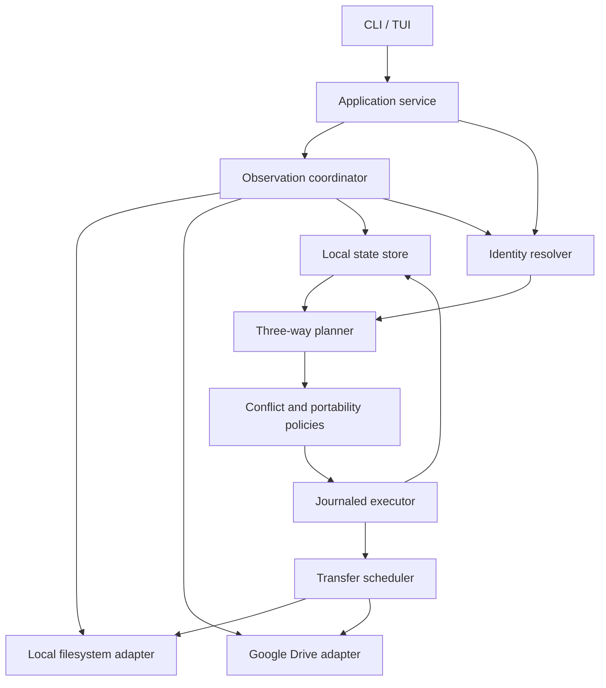

# Aethel Core Rebuild and Command Redesign

Status: Proposal; no runtime changes implemented.

Date: 2026-10-01

Reviewed baseline: Aethel 1.3.18, commit `b8537c6`.

## 1. Recommended direction

Aethel should become an identity-based synchronization engine with a transactional local state store, a deterministic reconciliation planner, and a recoverable executor. Paths should describe an object's location, rather than determine its identity. Files and folders should follow the same identity model.

The recommended implementation is a TypeScript modular monolith, retaining Node.js, the current CLI/TUI, and normal files in Google Drive. Modules should expose narrow interfaces and run within one process initially. A daemon, microservices, a language rewrite, and a custom cloud backend are unnecessary for the first release. Native filesystem helpers can be added behind an adapter if platform tests show that Node's filesystem metadata is insufficient.

Daily commands should become `status`, `sync`, and `resolve`. The current staging workflow can remain as a compatibility interface during migration, but should cease to define the engine's state model.

The rebuild should first establish correct identity, planning, and recovery. Performance improvements should then reduce unnecessary scans, transfers, and retries. Increasing concurrency alone does not address the current structural limitations.

Unattended synchronization is a release requirement. Conflicts are persistent work items, not fatal engine errors: independent work continues, conflicting versions remain recoverable, and subsequent runs require no interactive prompt. Automatic operation must not imply automatic selection of a winning version.

## 2. Findings in the current implementation

The code already includes three-way comparison, rename handling, hash caching, bounded transfer concurrency, persistent HTTPS connections, integrity checks, and a Drive Changes API path. These mechanisms should be assessed and reused where appropriate.

| Observed implementation | Architectural consequence |
| --- | --- |
| `src/core/snapshot.js:270` emits file records keyed by path without a persisted filesystem identity; directory records mainly represent empty folders. | Local moves must be inferred after the fact. Non-empty directories lack complete first-class identity. |
| `src/core/drive-api.js:789`, `buildRemoteFiles()`, retains file IDs but emits only empty directories. | The diff layer loses folder information that the Drive adapter already possesses. |
| `src/core/diff.js:932` explicitly limits local folder rename candidates to siblings and uses descendant matching. | Moving a directory between parents falls outside this recognition rule; simultaneous content and structure edits reduce the available evidence. |
| `src/core/diff.js` combines path remapping, rename inference, conflict promotion, ancestry reconstruction, and pack comparison. | Correctness depends on the interactions and ordering of special cases. |
| `src/core/sync.js:544` partitions operations into categories; `repository.js:389` executes before saving a new snapshot. | Dependencies and durable progress should become explicit. Partial success and interruption require recovery across separate state writes. |
| `src/core/drive-api.js:1214` downloads into the destination and restarts interrupted downloads from zero. | Existing content can be truncated before a replacement is verified, and failed large transfers repeat work. |
| `snapshot.js`, `drive-api.js`, and `http-agent.js` already contain concurrency, caching, streaming, and connection reuse. | The speed problem requires measurement; absence of these features is not the explanation. |

These are findings from source inspection, not a measured performance diagnosis. Existing rename and conflict tests provide valuable regression fixtures. Comments in older code are not sufficient evidence of current behavior; implementation and tests should control migration decisions.

## 3. Module boundaries



| Module | Responsibility | Boundary |
| --- | --- | --- |
| `domain` | Entities, observations, evidence, conflicts, operation schemas | No filesystem, database, HTTP, or UI imports |
| `state` | Transactions, entity bindings, baselines, cursors, operation journal, schema migration | Stores observations separately from confirmed synchronization |
| `observe` | Complete scans, incremental refresh, dirty scopes, scan generations | Reports unknown or inaccessible state explicitly |
| `identity` | Associate observed objects with tracked entities; explain ambiguous matches | Does not execute moves or delete candidates |
| `reconcile` | Pure three-way comparison and dependency graph construction | Identical inputs produce the same plan |
| `policy` | Conflicts, name collisions, supported file types, selected scope | Explicit decisions become plan inputs |
| `execute` | Preconditions, locks, durable operation progress, verification, recovery | Only component allowed to orchestrate synchronization writes |
| `transfer` | Streaming, resumption, scheduling, backpressure, checksums | Does not decide which version should win |
| `adapters/local` | Filesystem identity, safe replacement, path rules, watching | Platform details stay here |
| `adapters/drive` | IDs, parent relationships, change feed, transfers, capabilities | Converts provider responses into domain observations |
| `application` | `inspect`, `plan`, `apply`, `resolve`, `recover`; bounded unattended run lifecycle | Shared by CLI, TUI, and scheduler invocations |

Initial layout:

```text
src/engine/
  domain/        state/          observe/
  identity/      reconcile/      policy/
  execute/       transfer/       application/
  adapters/local/
  adapters/drive/
src/cli/
src/tui/
```

The provider interface should describe capabilities such as stable IDs, metadata moves, content checksums, resumable writes, and conditional mutations. The engine must not assume that every provider supplies every capability. Additional providers should be implemented only after the local and Drive contracts are stable.

## 4. Identity and persistent state

### 4.1 Entity model

Every tracked file and directory receives an opaque `entityId`. A replica binding connects that entity to a local object or provider object. The binding, not the filename or content digest, carries continuity.

```text
Entity:       entityId, kind
Binding:      entityId, replicaId, providerObjectId?, localObjectKey?
Observation:  entityId, replicaId, parentEntityId, originalName,
              contentDigest?, size?, revision?, existence,
              scanGeneration, completeness
Baseline:     entityId, lastConfirmedLocal, lastConfirmedRemote,
              baseContentRef?, generation
Operation:    operationId, planId, entityId, kind, dependencies,
              preconditions, intendedResult, state, receipt
```

Additional tables should hold conflicts, transfer sessions, change-feed cursors, name mappings, retained content references, and deletion tombstones. Unique constraints should apply to provider IDs within their provider/account scope. Original names must remain available even when a local projection requires a different name.

A folder rename changes its name; a move changes its parent. Descendants retain their identity and parent relationships. Derived paths can be cached and invalidated after ancestor changes, without representing every descendant as a separate rename.

Drive bindings use Drive file IDs, including directory IDs. Device-local keys use filesystem object identifiers where available, qualified by volume and device context. Such keys are evidence, not universally stable identifiers: inode reuse, atomic editor saves, hard links, cross-volume moves, and copied workspaces all require explicit handling.

### 4.2 Identity resolution order

1. Apply known intent from an Aethel-managed move or previously journaled operation.
2. Match a known provider ID or validated local object key, rejecting ambiguous or inconsistent bindings.
3. Use known directory continuity to match descendants beneath a moved parent.
4. Detect atomic-save replacement at an existing tracked path; preserve logical file continuity while recording that the physical object changed.
5. Consider unmatched delete/add pairs using content, size, ancestry, and available event evidence. A unique equal-content candidate is evidence of a possible move, not proof.
6. Record an identity conflict when evidence cannot distinguish a move from deletion plus an independent copy. Do not turn uncertain identity into an automatic destructive action.

Content similarity may rank suggestions, but should not authorize overwrites. Two identical files remain two entities. A move combined with a complete rewrite and loss of filesystem identity cannot always be reconstructed from final snapshots. The system should expose that limitation rather than claim universal rename detection.

Watcher events accelerate observation but are not the source of truth. A missed-event interval marks its scope dirty and triggers reconciliation. Optional `aethel mv` remains useful because it records intent, while ordinary Explorer/Finder/shell changes remain supported through observation.

### 4.3 Storage location

Use SQLite transactions for machine-local state and an append-oriented operation journal. Keep the live database in the platform's local application-state directory, outside the synchronized workspace. `.aethel/` should contain only a small workspace marker and portable configuration; replica IDs, credentials, active sessions, and local object keys must not be copied between devices as authoritative state.

This matters for workspaces already located inside another synchronization service. SQLite WAL depends on same-host coordination and does not operate as a multi-machine database over a network filesystem. A consistent export should be used for backup or diagnostic transfer. [SQLite WAL documentation](https://www.sqlite.org/wal.html)

A copied workspace must register a new local replica and rebuild its local bindings. Loss of the state database triggers conservative reattachment; it must not imply mass deletion. Credentials belong in the platform credential store or protected account storage, separate from repository files.

## 5. Reconciliation and conflict resolution

The planner compares baseline, current local state, and current remote state by entity. It compares existence, location, type, and content separately. A location change and a content change are often compatible.

| Local change | Remote change | Planned result |
| --- | --- | --- |
| Rename or move | Unchanged | Update remote name/parent while retaining its ID |
| Unchanged | Rename or move | Move the local object after destination checks |
| Move | Content edit | Combine the location and content changes if identity is established |
| Content edit | Identical content edit | Record convergence; no content transfer |
| Content edit | Different content edit | Three-way text merge when safe; otherwise content conflict |
| Move to A | Move to B | Location conflict if the destinations differ |
| Delete | Edit or move | Conflict; retain recoverable content |
| Delete folder | Add/edit descendant | Subtree conflict; no recursive deletion |
| File replaced by folder | Concurrent file edit | Type conflict |
| Independent additions at the same projected name | Independent additions | Name collision; retain both identities |
| Unchanged | Permission loss or incomplete listing | Unknown state; no deletion |

Text merging requires retained baseline bytes, not just checksums. Retain bounded base content for eligible text files. Preserve encoding and newline conventions. Missing base content, overlapping edits, binary files, and unsupported formats produce conflicts. A clean textual merge proves mechanical compatibility, not semantic correctness; merged content must remain inspectable.

Conflict records should include stable IDs, the affected entities, baseline/local/remote versions, the reason, and allowed resolutions. A resolution references those exact versions. If either side changes before execution, the resolution becomes stale and must be reevaluated. `keep both` creates a distinct entity with a collision-safe name and records provenance.

Plans contain a dependency graph rather than a list sorted only by operation type. Dependencies include parent creation before child creation, destination preparation before relocation, and verification before deletion. Swapping names and case-only renames may require temporary names. Cycles in the resulting folder graph are invalid plans.

## 6. Execution, interruptions, and concurrent writers

Each operation follows a durable state machine:

```text
planned → prepared → applying → verified → committed
                         ↘ uncertain / retryable / conflict
```

Before mutation, the executor records intent, reserves required resources, and checks the observed source and destination. After mutation, it verifies the result and commits the receipt with the corresponding baseline update in one local transaction. Observation alone never advances the synchronized baseline.

An interrupted `applying` operation is inspected before retrying. A timeout does not establish whether a remote write succeeded. Reconciliation must identify an already-created object, completed move, or completed transfer rather than blindly repeating the request. Drive supports pre-generated IDs for supported creates, allowing retries against a known ID; a conflict response still requires verification of the resulting object. [Drive upload guidance](https://developers.google.com/workspace/drive/api/guides/manage-uploads)

For downloads, write a temporary file on the destination filesystem, verify content and source version, recheck the destination, then perform the platform's safe replacement sequence. Keep the original recoverable until the replacement is committed. Windows locks or a changed destination leave the operation pending instead of discarding the original. Cross-volume moves require copy, verify, and source removal as separate journaled steps.

For uploads, bind a session to immutable input bytes. Prefer a filesystem snapshot/reflink when available, otherwise spool mutable input before uploading. This has a disk-space and I/O cost that must be measured. Stat checks alone cannot guarantee that a file remained unchanged during transfer. A changed source creates a new version and invalidates incompatible resumable sessions.

One local writer owns the workspace execution lock; the CLI and TUI use the same service. Entity and subtree dependencies prevent parallel operations from colliding inside that writer. These locks do not coordinate other devices or editors.

Drive revision/version observations are useful stale-state checks, but a read followed by a write is not an atomic compare-and-swap. Conditional-write guarantees must be demonstrated for each exact endpoint before the adapter advertises them. Preflight and postflight checks reduce races but cannot prove prevention of every concurrent overwrite. Preserve available versions and surface detected races. A local operation journal makes progress recoverable; it does not make a multi-file Drive update atomic.

If strict lossless multi-writer history becomes mandatory, introduce a separate managed-storage mode with immutable content objects and per-replica append-only commits. That mode requires its own synchronization protocol and sacrifices direct editing of ordinary Drive files. It should not be silently mixed into the default mode.

### 6.1 Unattended execution contract

`sync --non-interactive` must perform one bounded synchronization cycle without reading stdin or opening an authentication browser. An operating-system scheduler can invoke this same command repeatedly; a separate always-running engine is not required. Missing credentials, unsupported decisions, and unresolved conflicts become durable status records. Authentication renewal that requires user interaction suspends affected remote work and reports `auth_required`.

Every cycle acquires the workspace lock, reconciles uncertain operations, refreshes observations, constructs a new plan, applies eligible components, and persists a structured run result. Overlapping invocations coalesce or return `already_running`; they must never steal an active writer's lock. Crash recovery must verify lock-owner liveness using a platform-appropriate mechanism rather than treating elapsed time alone as proof of abandonment. Shutdown and run deadlines stop admission of new work and checkpoint in-flight work for later reconciliation.

The default conflict policy is `preserve`: retain conflicting observations and available content, defer mutations of the disputed entity, and continue unrelated work. The baseline of that entity remains unchanged until a resolution is verified. A run can therefore complete successfully as an execution cycle while reporting `needs_attention` for its data state. The next scheduled run still proceeds.

| Situation | Automatic behavior |
| --- | --- |
| Both replicas contain identical content | Record convergence after verifying identity and location |
| Established move on one side, content edit on the other | Combine changes when preconditions and provider capabilities permit |
| Different content on both sides | Preserve both observed versions; keep the conflict open |
| Clean three-way text merge | Produce an inspectable candidate; automatic application requires an explicit policy for eligible paths/formats |
| Delete/edit, divergent moves, uncertain identity, or type conflict | Preserve disputed objects; defer affected operations |
| Conflicted directory with otherwise unrelated changes | Block operations whose path, ancestry, or write footprint overlaps; allow independent components |
| Repeated unchanged conflict | Reuse the conflict record and retained versions; perform no duplicate conflict-copy writes |
| New edit to an already-conflicted file | Add a new version to the existing conflict lineage and invalidate obsolete resolutions |
| Missing access, incomplete scan, or unavailable root | Mark the scope unknown; defer its mutations and deletion inference |

Dependency edges alone are insufficient for isolation. Each operation needs a read/write footprint covering identities, destination names, and affected subtrees. A pending child conflict must prevent an ancestor delete or move that would invalidate its recorded location. Independent siblings can proceed when their footprints do not overlap. A shared parent existing in the graph must not unnecessarily block every child.

### 6.2 Conflict preservation and bounded storage

Conflict metadata should contain a stable lineage ID, canonical baseline and replica version descriptors, retention references, policy version, lifecycle state, and notification state. Repeated observations of the same version pair must be idempotent. New observed versions extend the lineage instead of repeatedly creating new top-level conflicts.

When accessible, capture exact conflicting bytes into an immutable recovery store before an Aethel operation could overwrite or remove them. Local snapshots must use the immutable-input mechanism described above. Remote captures must bind to a stable revision where supported, or be verified against before/after metadata and retried when the source changes. Failure to obtain stable bytes is reported as `preservation_pending`; it must not be labeled preserved. An unreachable version cannot be guaranteed recoverable merely because its checksum is recorded.

Recovery objects stay outside the ordinary synchronized tree so they cannot recursively trigger new conflicts. Index them by version identity and digest, with references from all relevant conflicts. Unresolved conflict content is pinned against automatic garbage collection. Retention budgets constrain admission: when the budget or free-space reserve is exhausted, defer new preservation-dependent writes and report `storage_required`, while permitting independent operations that remain safe. Never evict unresolved versions silently to meet a quota.

The default policy does not create visible conflict copies on every device. An optional `keep-both` policy may materialize separate files for eligible content conflicts, but must persist the chosen destination, entity binding, provenance, and create-operation ID before the write. Retries inspect that same destination/object. Structural conflicts remain deferred. Cross-device deduplication requires a shared, provider-verifiable resolution identity; until that mechanism is validated, automatic materialization is restricted to a configured resolution writer. A local journal alone does not prevent two devices from independently creating copies.

### 6.3 Automatic mutation guarantees

Unattended mode must consult adapter capabilities for each destructive or replacing mutation. If Aethel cannot establish a conditional mutation or another verified mechanism that preserves the version being replaced, it must defer that mutation or use an explicitly configured non-destructive publication workflow. Merely checking metadata immediately before a write does not satisfy this gate. Additive operations and independent safe work may continue while the disputed update remains pending.

This requirement applies to automatic conflict resolutions as well as ordinary updates. A backed-up observed version does not protect a later version written by another device between the backup and replacement. Local filesystem replacement also needs a documented concurrency boundary; an application lock does not lock unrelated editors. Capability tests must determine where safe automatic replacement is available and where the operation must remain deferred. Deferred work must remain visible rather than being reported as fully synchronized.

Consequently, ordinary Drive mode targets unattended progress with explicit pending work, not an unconditional guarantee that every concurrent edit will converge automatically. If implementation probes cannot meet the required replacement guarantees for a workflow, enabling that workflow requires managed immutable storage or a separately established writer-control protocol. A best-effort last-writer-wins fallback must not be enabled by default.

### 6.4 Retry, deletion, and operational controls

Transient failures use exponential backoff with jitter, server-directed delays where supplied, and bounded attempts and elapsed time per cycle. Persist `nextAttemptAt` so frequent scheduled invocations do not reset backoff. An unchanged conflict is not retryable work; reevaluate it when observations or policy change. Authorization and configuration failures wait for repair. A provider circuit breaker suppresses repeated failing calls without preventing safe independent local work.

Automatic deletions require complete observations, established identity, a confirmed baseline, and recoverability through verified trash/quarantine or retained content. Permanent purge is a separate explicit operation. A persisted deletion guard evaluates both a configured absolute count and fraction of the tracked scope, aggregating pending deletions across retries and path selections. Exceeding either limit defers those deletions; it must not be bypassed by splitting one deletion into smaller runs. Acknowledgment binds to the reviewed candidate set, and changed candidates require reevaluation. Missing roots, ignore changes, and permission loss never qualify as deletion evidence.

Structured results distinguish `completed`, `needs_attention`, `retry_scheduled`, `auth_required`, `storage_required`, and `already_running`, with counts of applied, deferred, failed, and unresolved operations. Reports must include the last successful observation and application times so repeated executions cannot conceal lack of progress. A notification adapter, if configured, emits changes in actionable state and recovery, with deduplication and backoff; unchanged conflicts do not generate an alert on every cycle. Notification failure does not roll back completed synchronization.

## 7. Google Drive integration

The adapter should retain the complete object graph, including non-empty directories, parent IDs, names, type, available checksum, revision/version, and access state. Names are not unique object keys. Metadata relocation uses the existing file ID; parent changes use the provider's parent-update mechanism. [Drive file resource](https://developers.google.com/workspace/drive/api/reference/rest/v3/files)

Initial indexing should obtain a change-feed cursor before enumeration, build a candidate inventory, then replay subsequent changes before publishing a usable generation. Persist applied changes and cursor advancement together so a crash cannot acknowledge an unapplied page. Incremental observations should be available to every workspace size, not only a large-tree optimization. Cursor semantics follow the [Drive Changes API](https://developers.google.com/workspace/drive/api/guides/manage-changes).

The index must distinguish an object's deletion from loss of access or movement outside the configured root. Folder entry into the root requires descendant discovery; ancestor moves require recalculating subtree reachability even if descendants have no individual change records. Incomplete enumeration prevents deletion planning. Periodic audits repair drift; the change feed is not a globally atomic tree snapshot.

Shared Drives require capability and permission checks and appropriately scoped requests/cursors. A move that cannot preserve identity across storage boundaries becomes a separate reviewed copy-and-remove operation or an unsupported operation, never an implicit recreation.

Google-native Docs, Sheets, and Slides should use an explicit projection policy: link-only by default, or configured export as a derived local file. Editing that export must not silently replace the native document. A separate import workflow can be designed later. Shortcut handling should also be explicit, with no automatic recursive traversal. Native exports and binary downloads have different API behavior. [Drive download and export guide](https://developers.google.com/workspace/drive/api/guides/manage-downloads)

## 8. Cross-platform filesystem policy

Support must be based on filesystem capabilities rather than OS names alone. Case sensitivity, normalization behavior, stable IDs, atomic replacement, and watcher reliability vary by volume.

| Concern | Required behavior |
| --- | --- |
| Case and Unicode normalization collisions | Preserve original names; calculate target comparison keys; detect collisions before writing |
| Windows reserved names, invalid characters, trailing dots/spaces | Block the affected projection by default; offer explicit reversible name mapping |
| Case-only rename | Use a collision-checked temporary name where required |
| Drive duplicate names | Preserve separate IDs; require mapping or resolution instead of deduplication by name |
| Symlinks and junctions | Do not follow by default; report unsupported entries or use an explicit link policy |
| Hard links | Treat directory entries separately; never infer that all equal local object IDs can be collapsed |
| Permissions and executable bits | Preserve locally where supported; define separately whether portable metadata is synchronized |
| Long paths and locked files | Validate capabilities and leave blocked operations recoverable |
| Sparse/cloud-placeholder files | Distinguish unavailable bytes from absence; make hydration explicit |
| Ignore-rule changes | Recompute scope; exclusion is not a request to delete the other replica |
| Unmounted or inaccessible root | Fail observation; never interpret an empty scan as mass deletion |

Windows naming constraints require explicit handling rather than universal lowercasing or destructive filename normalization. [Microsoft filesystem naming rules](https://learn.microsoft.com/en-us/windows/win32/fileio/naming-a-file)

All paths must be constructed from validated components. Provider names, shortcut targets, archive entries, and symlink traversal must not escape the configured root. Filesystem traversal checks must account for replacement races, not merely reject textual `..` segments.

## 9. Transfer performance

Record scan, hashing, API listing, planning, network transfer, retry, and verification times independently. Also record API count, payload bytes, repeated bytes, cache hit rate, throttling, peak memory, and temporary disk use. No speedup factor is claimed before comparable measurements.

| Workload | First optimization |
| --- | --- |
| Mostly unchanged trees | Persist metadata indexes and change cursors; rescan dirty scopes; periodically audit |
| Folder rename/move | One metadata operation for the folder when supported; zero descendant content transfers |
| Many small files | Reuse connections and parent indexes; bound metadata and transfer queues separately |
| Large files | Persist resumable upload sessions; checkpoint supported partial downloads against a stable source version |
| Slow or throttled connections | Adaptive concurrency, jittered retry, cancellation, and byte/memory budgets |
| Repeated verification reads | Calculate needed digests in the same stream where possible |

Small-file uploads can use multipart requests; large or interruption-prone transfers should use resumable uploads. Persist the session URL securely and the server-confirmed offset; recover by querying actual session progress. Chunk sizes must follow Drive's alignment requirements. Expired sessions restart cleanly. Resumption avoids retransmitting acknowledged data; it is not binary delta synchronization. [Drive upload guidance](https://developers.google.com/workspace/drive/api/guides/manage-uploads)

Separate queues for metadata, small-file content, large-file content, and hashing prevent large transfers from occupying every slot. Initial limits are tuning parameters, not performance claims. Retain the current streaming and keep-alive benefits while replacing fixed global assumptions with bounded resource budgets.

Drive HTTP batching does not support media uploads/downloads and is not an atomic transaction. It should not be presented as a way to bundle arbitrary file transfers. [Drive performance guidance](https://developers.google.com/workspace/drive/api/guides/performance)

In normal-file mode, changing file content generally requires uploading the new content; chunking cannot be assumed to provide rsync-style patches. Existing packs should remain an explicit optional backend. A single changed member can require repacking a whole archive and prevents direct individual-file access on Drive. Content-addressed chunks are a later managed-storage option, justified only by measurements and acceptable usability tradeoffs.

## 10. Command redesign

The default workflow should require neither staging nor a misleading Git-style commit:

```sh
aethel init --drive-folder <id>
aethel status
aethel sync --dry-run
aethel sync
```

| Command | Proposed contract |
| --- | --- |
| `status [path]` | Refresh observations and show pending operations/conflicts; never mutate synchronized content |
| `status --offline` | Show cached observations with their age and incomplete scopes |
| `sync [path]` | Reconcile both directions and apply non-conflicting independent components |
| `sync --dry-run` | Produce the same planner output without executing mutations |
| `sync --non-interactive --json` | Run one bounded unattended cycle using the default `preserve` conflict policy; no prompts or browser authentication |
| `sync --direction upload\|download` | Limit propagation direction; preserve opposing edits as conflicts |
| `resolve <conflict-id> --keep local\|remote\|both` | Record a version-bound resolution; subsequent `sync` applies it |
| `resolve <conflict-id> --file <merged-file>` | Record replacement content for an eligible content conflict |
| `history` | Show completed/partial synchronization runs and recoverable versions |
| `doctor` | Report incomplete scans, stale bindings, failed sessions, and state integrity |

`sync` should resume or reconcile unfinished journal entries automatically before making a new plan. A scope selection must include necessary dependencies or explain why it cannot proceed; selecting one descendant must not silently synchronize unrelated siblings. Unresolved conflicts block their dependency components while independent work can complete.

Default synchronization propagates confirmed tracked deletions. Direction limiting is not an authoritative mirror: `--direction upload` must not delete previously unknown remote files or overwrite remote edits. A separate advanced `mirror --source local|remote --dry-run` can represent intentional one-sided replacement. Its destructive behavior should require an explicit execution flag and fresh preconditions, replacing the overloaded meaning of `--force`.

For automation, use stable JSON output and distinct exit codes: `0` for completed/no pending selected work, `2` for unresolved conflicts, `3` for operational failure or partial application, and `4` for invalid configuration/arguments. If failure and conflicts coexist, operational failure takes precedence and JSON lists both. An optional `--require-clean` can prevent any new apply when the plan contains conflicts, without claiming transactional execution.

Refine these codes for unattended operation: `2` also covers policy-deferred work requiring attention, while `3` covers incomplete work due to operational failure, including retry scheduling. Safe independent work completed alongside conflicts remains code `2`, not an operational failure merely because some entities were deferred. `already_running` returns `0` with an explicit skipped-run result and no claim that this invocation synchronized content. Scheduler integration must treat code `2` as attention-needed and continue future scheduled cycles; it must not disable the schedule or enter an immediate retry loop. Detailed reason codes remain in JSON. No scheduler or notification is created by this proposal.

Example unattended invocation after workspace initialization and authentication:

```sh
aethel sync --non-interactive --json
```

Conflict policy, retry budgets, retention limits, and deletion thresholds belong in versioned workspace policy with inspectable effective values. Policy changes invalidate affected plans. The default automatic policy must never select a winner using modification timestamps, clock order, or filename similarity.

`status --detail` provides entity evidence and content differences where available. Textual patches are inspection or merge inputs; they are distinct from provider transfer protocols. `sync --dry-run` is the operational preview. This distinction avoids requiring users to understand three overlapping forms of diff.

Migration must preserve existing scripts: legacy `add`/`commit`, `push`/`pull`, `diff`, and resolution aliases initially route through a compatibility layer with their documented semantics. They must not silently acquire the new semantics. Git-like branch/tag commands should remain legacy snapshot labels until a separate decision is made about history; renaming a label does not create a content branch. New help and onboarding should emphasize the smaller command set.

The TUI should present the same plan and conflict records. Its managed-workspace writes must route through the application service rather than bypassing the executor with direct provider operations.

## 11. Rebuild and migration sequence

| Phase | Deliverable | Acceptance gate |
| --- | --- | --- |
| 1. Contracts and evidence | Versioned schemas, operation vocabulary, fixtures, baseline benchmarks | Existing behavior and known failures reproducible without live destructive tests |
| 2. State and observation | SQLite state, complete folder graph, replica bindings, completeness flags | Restart preserves observations; unavailable scopes cannot produce deletes |
| 3. Planner | Identity matching, three-way field comparison, conflict records, dependency graph | Rename/move matrix passes; deterministic plans; ambiguous identity stays non-destructive |
| 4. Executor | Durable journal, preconditions, safe replacement, operation recovery | Fault injection at each state boundary preserves recoverability |
| 5. Drive and transport | Durable change feed, resumable transfer, adaptive queues | Disposable live-Drive tests confirm recovery and supported capabilities |
| 6. Commands and TUI | Shared service, `sync`, conflict workflow, compatibility adapters | CLI/TUI generate equivalent plans and preserve documented legacy behavior |
| 7. Migration and rollout | Read-only shadow comparison, explicit workspace migration, v2 engine selection | Windows/macOS/Linux checks, unattended reliability gates, and benchmark gates pass before default switch |

The first vertical slice should synchronize one ordinary file and one directory through move, edit, conflict, interruption, and restart. This validates the state/planner/executor contract before adding broad feature coverage.

Migration should back up legacy metadata, inventory both replicas, import trustworthy Drive IDs, and mark uncertain associations unresolved. A fresh common baseline is established only for verified matching pairs; disagreement must not be erased by initialization. Legacy pending staged operations require explicit translation with revalidation or disposal by user choice.

Run the new planner in read-only shadow mode while the existing engine remains the sole writer. Once migrated, a workspace must reject simultaneous use by incompatible engines. Rollback requires a fresh inventory because Drive changes cannot be undone by restoring an old local metadata file. Existing packs and snapshot refs need explicit compatibility readers before affected workspaces migrate.

## 12. Validation and measurable completion

The test matrix must include file and folder moves across parents, nested moves, case-only renames, duplicate content, atomic editor saves, rename plus rewrite, move/delete races, folder deletion with concurrent descendants, same-name Drive objects, type changes, permission loss, and ignored or unmounted scopes.

Property-based tests should generate operation sequences and verify identity uniqueness, acyclic parent graphs, preservation of unresolved versions, convergence after successful reconciliation, and absence of changes on a second unchanged run. Fault injection should cover a timeout after remote success, process termination around every journal boundary, full disk, source edits during upload, expired sessions, and stale conflict resolutions.

CI should run on Windows, macOS, and Linux. Real-volume checks should cover both case-sensitive and case-insensitive behavior and representative cross-volume moves. Live Drive checks must use disposable roots and include changes made outside Aethel. Mocks alone cannot establish provider concurrency or resumable-session guarantees.

Benchmark datasets should include 10,000 small files, a deep directory tree, several large files, and a mixed source/document workspace. Compare cold indexing, unchanged warm sync, a 1% edit set, a directory move, and an interrupted transfer on the same hardware/network. Report median and tail latency, bytes, requests, memory, and disk use.

Acceptance criteria are behavioral before numerical: an established folder move transfers zero descendant content bytes; an unchanged run transfers no content; interrupted downloads preserve the prior file; retries do not duplicate supported creates; incomplete observations do not authorize deletion; and restart never records unverified work as synchronized. Throughput targets should be set after the initial baseline, with regressions requiring an explicit explanation.

Unattended operation must pass the following additional release gates:

| Test | Required result |
| --- | --- |
| 1,000 repeated cycles with unchanged conflicts | No extra recovery objects or visible conflict copies; stable conflict IDs; no repeated actionable notification |
| Conflicted subtree plus independent edited files | Independent eligible files synchronize; blocked ancestry is untouched |
| Process termination at every preservation and mutation boundary | Recovery verifies uncertain outcomes; no unresolved version is garbage-collected; no unverified baseline advances |
| Two devices edit and sync concurrently, including a write between preflight and mutation | Conditional protection holds or the unsafe operation is deferred; no silent fallback to last-writer-wins |
| Full disk or exhausted retention budget | Existing retained versions survive; preservation-dependent mutations stop; status explains the blocked work |
| Network loss, quota errors, expired credentials, and missed watcher events | Bounded execution, durable backoff, explicit status, and automatic resumption when the cause clears |
| Overlapping scheduler invocations and a crashed lock owner | At most one active local writer; crash ownership is recovered safely |
| Repeated mass-deletion plans split across invocations | The persisted guard remains effective until the exact candidate set is acknowledged |
| Conflict resolution followed by a new edit before apply | The obsolete resolution is rejected and the new version remains represented |
| Offline replica returns after retention cleanup | Expired baseline/tombstone context triggers conservative reattachment, not resurrection or blind deletion |

A seven-day unattended soak test on each supported OS should combine scheduled runs, generated edits, persistent conflicts, restarts, and injected network failures. Record progress and resource usage throughout; unchanged conflicts must not cause unbounded storage, retry, or notification growth. Passing this test supplements, rather than replaces, the deterministic crash and concurrency tests. Automatic mode must not be declared production-ready until these gates and the provider capability probes pass.

## 13. Decisions reserved for implementation

The proposal recommends normal Drive files as the default, TypeScript with the existing runtime, local SQLite state, conservative ambiguous-identity handling, and the three-command daily workflow. Implementation still needs a SQLite binding/package compatibility spike, per-platform identity and safe-replacement probes, validation of exact Drive mutation preconditions, and measured limits for base-content retention and transfer spooling.

These checks determine implementation details and guarantee boundaries. They do not require a different overall architecture unless strict multi-device transactional writes or arbitrary binary delta transfer becomes a mandatory requirement.
